# Parallel Amplitude Embedding
This is our submission for QHack24 - it is an extension of the algorithm QPIXL (Amankwah et al., May 2022, https://www.nature.com/articles/s41598-022-11024-y) that parallelizes the input so that for N 'address qubits' you can have N 'data qubits', which has the same circuit depth as just encoding a single image in QPIXL. This is done by exploiting the fact that in QPIXL each address qubit is targeted only once per layer in QPIXL. This encoding works, but decoding the image is less straightforward. Nonetheless, this submission implements that and attempts to use this parallel QPIXL to do some batched quantum machine learning. 

- Contents
    - Introduction
    - QPIXL (```QPIXL.ipynb```)
        - compression
    - parallel QPIXL (```Parallel_QPIXL_submission.ipynb```)
    - Creative Uses
        -  Photoshop (```QPIXL.ipynb```)
            - single image transforms
            - entangling multiple images
            - Simple RGB images
            - animation
    - Scientific Uses (```QPIXL.ipynb``` and ```Parallel_QPIXL_QML.ipynb```)
        - QNN with QPIXL embedding for Cancerous cell classification
            - Cancer Dataset with classical autoencoder preconditioning
            - Loading data with resnet18 autoencoder
            - Defining QNN tree tensor network ansatz
            - running hybrid classical-quantum QNN


# Introduction
A series of python modules for implementing Quantum Image and Signal Processing protocols for image encoding, classification, and alteration using Quantum Machine Learning.


The readme goes through several embedding schemes we have implemented that are either good for simulating (simulator friendly encodings) and NISQ friendly hardware friendly. 
We have implemented an embedding in qiskit for the FRQI-QPIXL framework  (Amankwah et al., May 2022, https://www.nature.com/articles/s41598-022-11024-y ) and parallel qpixl that was inspired by the followup work of the same authors (Balewski, J. et al. (2024) https://doi.org/10.1038/s41598-024-53720-x). 
This is included in three folders, a qiskit version, a pennylane version and a CUDA cuQuantum version.  ```qpixl.py``` for the full version with compression, and  ```param_qpixl.py``` contains the parameterized version that can be used to generate a NISQ friendly image feature map for QML amongst other things. The folders also include files with ```parallel```, which include the parallelized version (of which inputting a single image is the same as doing QPIXL). The CuQuantum version only has the parallel code for this reason. 

- Contents
    - Introduction
    - QPIXL (```QPIXL.ipynb```)
        - compression
        -  Photoshop
            - single image transforms
            - entangling multiple images
            - Simple RGB images
            - animation
        - QNN with QPIXL embedding for Cancerous cell classification
            - Cancer Dataset with classical autoencoder preconditioning
            - Loading data with resnet18 autoencoder
            - Defining QNN tree tensor network ansatz
            - running hybrid classical-quantum QNN

# QPIXL

## Quantum killers for NISQ
The depth (and connectivity) of a circuit completely determines how well it can be implemented on existing hardware. The killing blow to most
algorithms is that they require fully connected and very deep circuits (which get decomposed to even deeper circuits with limited gatesets). 
Due to non-zero error rates, the probability that at least an error has occured throughout the run of a circuit eventually becomes 1. This can
be mitigated, but at some point it can't be done. This is why short circuits for flexible data embeddings are so important.

## Images in quantum computing
Although quantum computers have a more obvious to see advantage in quantum tasks, nonetheless it is thought that we can see some advantages in tasks involving
classical data loaded onto a quantum computer. Although pictures may not be 'the' data-type that will see an advantage from quantum computing, it is nonetheless 
the case that a lot of data can be input in an image-like format, and studying pictoral algorihtms is definitely way easier on the eyes than pure data-driven tasks! 
Also, with a quantum state representing an image, you can see the results of any quantum transformation of the picture as a new picture! Of course, it needs to be 
seen from many 'angles', but maybe it can help with visualizing what 

## QPIXL algorithm

Why do we need another type of embedding in the mix? QPIXL is a framework to decompose popular image encodings such as FRQI, NEQR and their improved counterparts. 
It works by optimally decomposing the gates, and removing any 0 angles that are found. Thanks to the optimal decomposition
the quantum gates can then be further reduced by removing pairs of CNOTS that used to be interweaved by rotation gates. 
They cancel out an become the identity. 
The FRQI embedding looks as follows: 

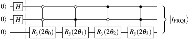

but decomposed into CNOTS and rotations it looks like this! 

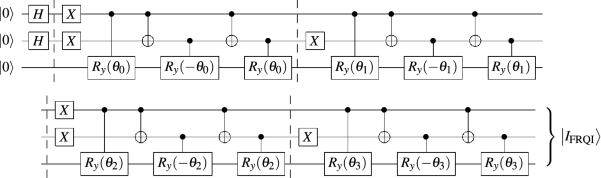

With QPIXL, the basic embedding, after transforming the image into an angle representation (using arctangent on the pixel values and a walsh hadamard transform) you have this much shorter decomposition! 

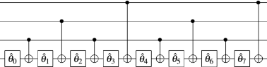

### Compression
If you set the angles 2-6 to 0 (or if they are already 0), you get something that looks like this! The 0 angle rotations are the identity, and 'disappear', and the remaining the pairs of CNOTS cancelling out :O

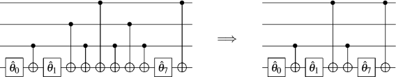


So you can greatly compress the depth up to some percentage (treshold at which you set angles to 0). Whaty does this look like? See the image below 

For a simple image that is hopefully familiar 

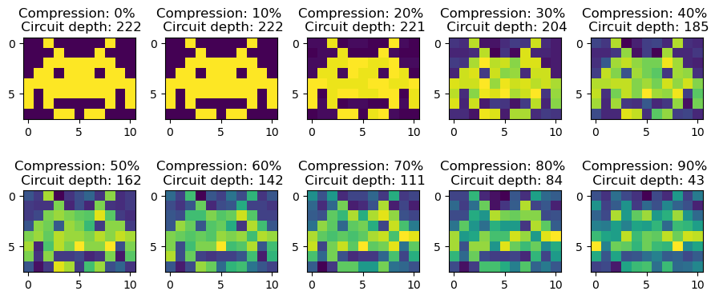

And a more complex image


This lets you see by how much you can compress an image and still retain a high level of detail, obviously finer features disappear the more compression you add, much like traditional JPEG compression. 

# Parallel QPIXL

Standard qpixl, as described above, as a standard circuit structure, which we add here for ease of reading:


The structure of QPIXL lends itself to a curious extension. Since the address qubits (all but the bottom qubit above) are each addressed by the data qubit (the lowest one in the figures above) individually. It is actually possible to add an additional data qubit (the one with the rotations) that then addresses a cyclic permutation of the qubits. This is shown below for some random data.  This parallelization method was inspired by the paper (Balewski, J., Amankwah, M.G., Van Beeumen, R. et al., Sci Rep 14, 3435 (2024), https://doi.org/10.1038/s41598-024-53720-x). We might have even managed to make an exact implementation but we did not have the time to either thoroughly read the work or to verify this, we do retain the possibility to compress the image if desired. This is not as stragightforward as in QPIXL, as this will have to be concerted with all other arrays. Still, this might still be a desired tradeoff to the linear depth WRT to the number of datapoints. 

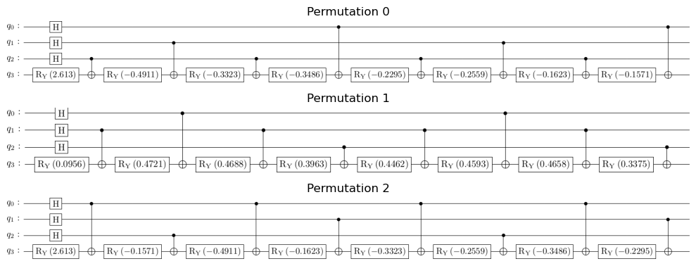

## Combining the three data streams into one!
As you can see, and hopefully believe, the three different permutation never intersect at any slice of the circuit, and as such, you can combine all three data streams into a single one! This can be easily done in this code by giving an array with up to N elements, where N is the number of address qubits. Now, in the same depth you can encode N arrays, and the bigger the single array, the bigger the savings in depth, since the QPIXL algorithm is linear in depth with respect to the number of elements in the array (0 entries are actually 'compressed' out, so padding is always a valid strategy)
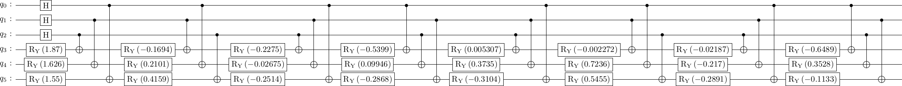

## Encoding 
Below, we show how the encoding and decoding multiple images within one circuit will look like. First you load and inspect your beautiful dataset
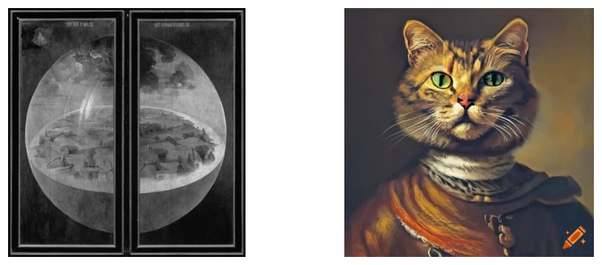
Now we can either pad or resize the data. Since these are images, we will make black and white copies with a size of 2^N pixels, which in this case is going to be 12 qubits, or 64*64 pixels. This gives us our compressed and reshaped images that we will encode. 
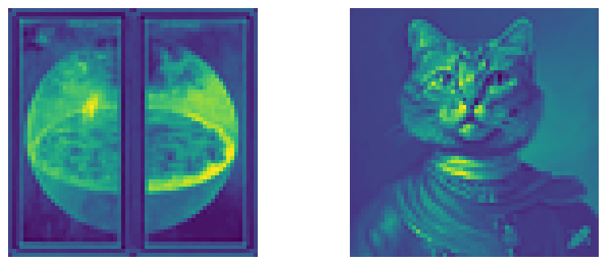
Not quite as majestic as the originals, but they are quantum ready, so to the trained eye, the compressed versions are even more special. 
In the circuit, we need 12+2 qubits, 12 qubits address the 64*64 pixels, and the other two qubits encode the angles that represent the data. We encode the data as before. Of course, we can also technically embedd the RGB colorspace directly, but to avoid giant graphs, we stick to a minimal example. The angles are encoded as in QPIXL, but now the decoding is more involved.
## Decoding
Unlike in qpixl that had a fairly straightforward encoding scheme, here we must trace out all data qubits except for the one that we want, and then permute the binary addresses back to what they would be before the cyclic permutation. For the implementation, you may inspect the code below, but suffice it to say that if you have $D$ data qubits and you are interested in image $d$ you would just take the partial trace
$$\rho_\text{d}=\text{Tr}_{D\neq d}[\rho_\text{full}]$$
This returns us our original images. Due to our selection of parameters, we only decode integers from 0 to 255, but this range is arbitrary. Since quantum compters cannot do infinitely precise rotations, you do have to lose some information even though the embedding is in theory perfect (then again, that is the case with normal computers anyway, so.... ) 

Since all the bit addresses are permuted, need to undo the permutation introduced by the parallel qpixl method by permuting the bitstring version of the index and then going back to an integer representation. 

```
def permute_bits(b,bitlength=8,shift=1): ## How you permute the bits after decoding
    b = bin(b)
    b = b[2:].zfill(bitlength)
    b = [b[(i + shift) % len(b)] for i in range(len(b))]
    return int(''.join(b),2)
```
And finally, you get back what you put in (minus some lost precision due to the 8 bit color values). 
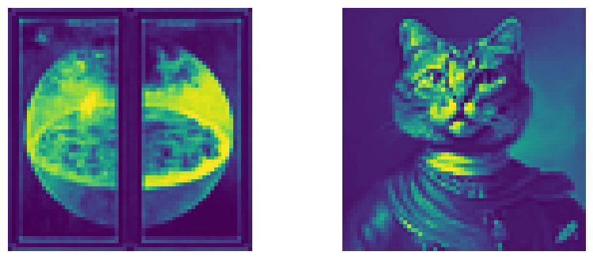


# Quantum photoshop
## Single image alteration
You can imagine that you can now do some quantum operation on this encoded state!!!
So what do a global rotation do to our image? Below is an exampled for RY rotations applied to each qubit with the same angle.


You can play around in the notebook for way more options! What does a superposition look like? Does seeing the imaginary part after a rotation look different from the real part? The world is your oyster and the code is ready fopr you to explore what quantum operations do to high-dimensional embeddings ina super visual way!

## Entangling multiple images

Of course, you can imagine, what if you load two quantum registers with images? Maybe you can entangle them and see the result. Here, the creation of the world, the tripicht from Bosch is entangled with the transpose of itself: 

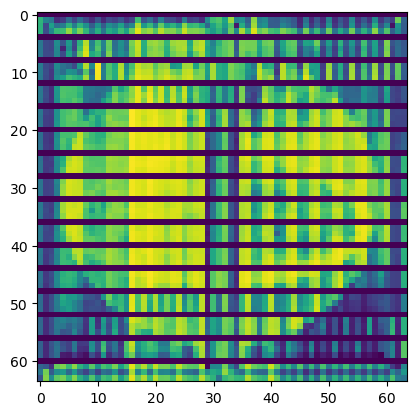

Kind of funky, doesn't make much sense, but maybe you can make something more beautiful?

## RGB Batch encoding
You can of course think that you can split the different channels and encode each one separately! There are schemes to do this more compactly, but this particular one is very nice for artistic purposes. For example, Mario here has found himself going through a very strange quantum pipeline where 2/3rds of him have been rotated around the Y axis :O

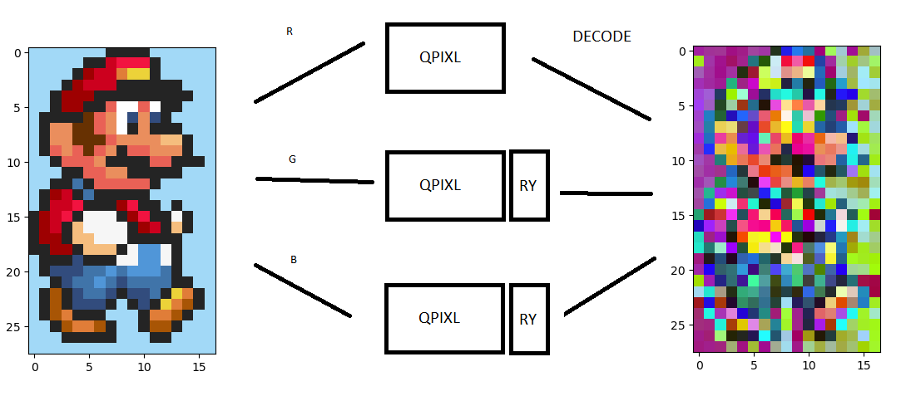

## Animation
You can animate the transformation from one statevector representing an image to another smoothely! Ever wondered what that looks like (using linear interpolation for the different angles?) The possibilities are endless - maybe you can use a time evolution operator? Creativity is your only boundary. 


## QNN with QPIXL embedding for Cancerous cell classification
Of course, all is well and fun, and we can visualize some cool quantum operations on an 'inmage state', but obviously the main reason for these embeddings is not to make nice pictures, but to use them to encode data for tasks like classification for QML, or we can use image embedding to encode different types of data - linear depth is a pretty nice embedding ratio after-all! 

# QML with QPIXL embedding with classical autoencoder for image compression
## Cancer Dataset with classical autoencoder preconditioning
So instead of using just a directly image loaded QML, we first pretrain a classical autoencoder and do a transfer learning approach. FOr this toy example we use a pretrained resnet18, but one could imagine refining model parameters to a dataset at the same time as the quantum weights! 

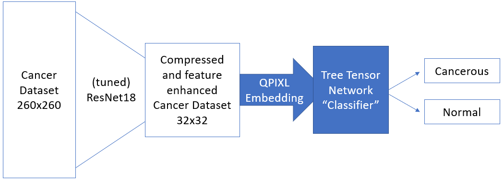

### Loading the data with ResNet18

We use the cancer dataset, which we prereduced to be 260x260 in size from around 500x500 classically, and left it to be a 'true' 'false' set, with the boolean value representing the presence of cancer

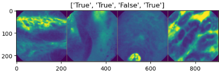

This is compressed by the autoencoder and then turned into angles for QPIXL to feed into the Quantum Ansats

### Defining QNN Tree Tensor Netwrok Ansatz

We then define an ansatz of the form 

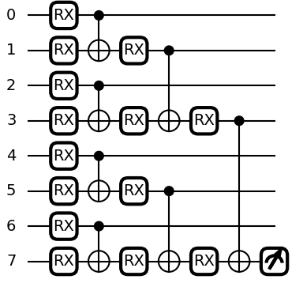

extended to all the 11 qubits + 1  of the input from QPIXL, we add additinal RZ rotations after each gate and allow it to output two measurements. 

### running hybrid classical-quantum QNN
We allowed this to train on a 70-30 split of the dataset using a cross-entropy loss function and the ADAM optimizer, with a stepsize of 4e-4 and 30 epochs. The idea is to optimize the autoencoder and classifier individually at first, getting them to a good initial state and then optimizing both together, sadly we did not manage to get that far, but the results for just optimizing the Quantum part on the ResNet18 comopressed feature vector encoded by QPIXL is very promising!  It reached an accuracy on the training data of 70% after 20 epochs! Alhtough the training accuracy is lower, but this is promising, maybe this is something that can be looked at further and compared to other embedding schemes! :D 

```
Training started:
...
...
Phase: train Epoch: 20/30 Loss: 0.6958 Acc: 0.6254      
Phase: test   Epoch: 20/30 Loss: 0.6296 Acc: 0.7099       
``` 
The model was pickled mid-training and can be found in the folder ```models/model_QCNN.pickle```, and can be loaded in the ```QPIXL.ipynb``` notebook. 

### Overall QPIXL summary
WE made modules that should make it easy to embedd qpixl into any image workflow, including parameterized forms that can be used by optimizers in QNN, optimization and QML tasks for both qiskit and pennylane. WE hope this will make it easier for researchers to quickly use such a powerful embedding strategy within their current workflow without having to re-implement everything (if they use packages such as qiskit and pennylane). Furthermore, we have shown how you can visualize complex quantum transformations of these high-dimensional quantum states in a friendly and fun pictoral way - and perhaps a way to make new art with these machines? Whatever the case, we hope that you find QPIXL and these schemes helpful! 
